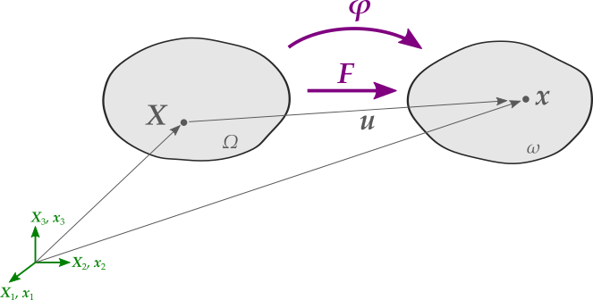

# Documentation



## What is this toolbox about?

Commercial FEM software packages offer interfaces (user subroutines written in Fortran) for custom defined user materials like UMAT in [Abaqus](https://www.3ds.com/products-services/simulia/products/abaqus/) or HYPELA2 in [MSC.Marc](http://www.mscsoftware.com/product/marc). In comparison to other scientific programming languages like MATLAB or Python Fortran is not as comfortable to use when dealing with high level programming features of tensor manipulations. On the other hand it's super fast - so why not combine the handy features from MATLAB or Python's NumPy/Scipy with the speed of Fortran? That's the reason why I started working on a simple but effective module called **Tensor Toolbox for Modern Fortran**. I adopted the idea to my needs from [Naumann, C. (2016)](http://nbn-resolving.de/urn:nbn:de:bsz:ch1-qucosa-222075).

## How to cite

[](https://doi.org/10.5281/zenodo.4077378)

If you use *Tensor Toolbox for Modern Fortran (ttb)* in your work, please cite this toolbox in your publications. Thanks! **Hint**: The DOI-badge always resolves to the latest version of this toolbox - if you prefer a version-specific DOI, hit the DOI-badge and pick a version on Zenodo.

Andreas Dutzler. *Tensor Toolbox for Modern Fortran - High-Level Tensor Manipulation in Fortran*. DOI: 10.5281/zenodo.4077378.

```
@software{dutzler2021,
  author       = {Andreas Dutzler},
  title        = {Tensor Toolbox for Modern Fortran - High-Level Tensor Manipulation in Fortran},
  doi          = {10.5281/zenodo.4077378},
  url          = {https://doi.org/10.5281/zenodo.4077378}
}
```

## Overview
- [Installation](installation.md)
- [Quick Start Guide](quickstartguide.md)
- [Tensor Data Types](tensordatatypes.md)
- [Functions](functions.md)
- Examples
- Example 1: [St.Venant-Kirchhoff Material](example_stvenantkirchhoff.md)
- Example 2: [Nearly-Incompressible Neo-Hookean Material](example_neohooke.md)
- Example 3: [Neo-Hookean Hyperelasticity with Maxwell-Viscoelasticity](examples/hypela2_nonlinear_viscoelasticity.f)

## Author
Andreas Dutzler, Graz, Austria.
I'm a PhD student at the Insitute of Structural Durability and Railway Technology at Graz University of Technology.

# Changelog
All notable changes to this project will be documented in [this file](../CHANGELOG.md). The format is based on [Keep a Changelog](https://keepachangelog.com/en/1.0.0/), and this project adheres to [Semantic Versioning](https://semver.org/spec/v2.0.0.html).

## Credits
Naumann, C.: [Chemisch-mechanisch gekoppelte Modellierung und Simulation oxidativer Alterungsvorgänge in Gummibauteilen (German)](http://nbn-resolving.de/urn:nbn:de:bsz:ch1-qucosa-222075). PhD thesis. Fakultät für Maschinenbau der Technischen Universität Chemnitz, 2016.

## Last updated: 2023/07/37
